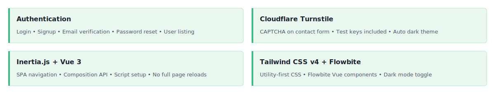
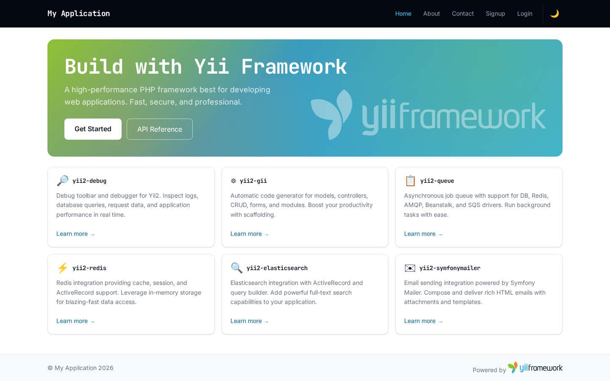
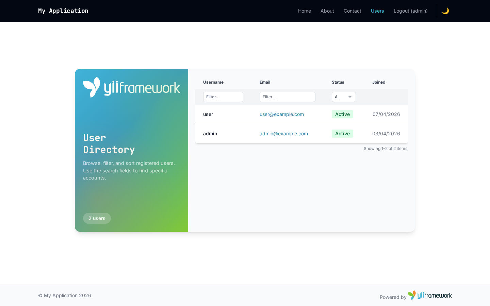

<!-- markdownlint-disable MD041 -->
<p align="center">
    <picture>
        <source media="(prefers-color-scheme: dark)" srcset="https://www.yiiframework.com/image/design/logo/yii3_full_for_dark.svg">
        <source media="(prefers-color-scheme: light)" srcset="https://www.yiiframework.com/image/design/logo/yii3_full_for_light.svg">
        
    </picture>
    <h1 align="center">Inertia.js + Vue 3 Application Template</h1>
    <br>
</p>
<!-- markdownlint-enable MD041 -->

<p align="center">
    <a href="https://github.com/yii2-extensions/app-inertia-vue/actions/workflows/build.yml" target="_blank">
        
    </a>
    <a href="https://codecov.io/gh/yii2-extensions/app-inertia-vue" target="_blank">
        
    </a>
    <a href="https://github.com/yii2-extensions/app-inertia-vue/actions/workflows/static.yml" target="_blank">
        
    </a>
</p>

<p align="center">
    <strong>Skeleton <a href="https://github.com/yiisoft/yii2">Yii2</a> application with Inertia.js + Vue 3 integration</strong><br>
    <em>Server-driven SPA with Tailwind CSS v4, Flowbite, dark mode, Cloudflare Turnstile, and Codeception tests</em>
</p>

Use the **"Use this template"** button on GitHub to create your own repository from this template.

## Features

<picture>
    <source media="(max-width: 767px)" srcset="./docs/svgs/features-mobile.svg">
    
</picture>

<picture>
    <source media="(prefers-color-scheme: dark)" srcset="docs/images/home-dark.png">
    <source media="(prefers-color-scheme: light)" srcset="docs/images/home-light.png">
    
</picture>

<picture>
    <source media="(prefers-color-scheme: dark)" srcset="docs/images/users-dark.png">
    <source media="(prefers-color-scheme: light)" srcset="docs/images/users-light.png">
    
</picture>

## Quick start

```bash
composer create-project --prefer-dist yii2-extensions/app-inertia-vue:^0.1 app-vue
```

## Docker

[](https://github.com/yii2-extensions/app-inertia-vue/actions/workflows/docker.yml)

```bash
docker compose up -d
```

## Documentation

- 📚 [Installation Guide](docs/installation.md)
- ⚙️ [Configuration Reference](docs/configuration.md)
- 💡 [Usage Examples](docs/examples.md)
- 🧪 [Testing Guide](docs/testing.md)

## Package information

[](https://www.php.net/releases/8.3/en.php)
[](https://github.com/yiisoft/yii2/tree/22.0)
[](https://packagist.org/packages/yii2-extensions/app-inertia-vue)
[](https://packagist.org/packages/yii2-extensions/app-inertia-vue)

## Quality code

[](https://github.com/yii2-extensions/app-inertia-vue/actions/workflows/static.yml)
[](https://github.com/yii2-extensions/app-inertia-vue/actions/workflows/linter.yml)
[](https://github.styleci.io/repos/1196250859?branch=main)

## Our social networks

[](https://x.com/Terabytesoftw)

## License

[](LICENSE)
