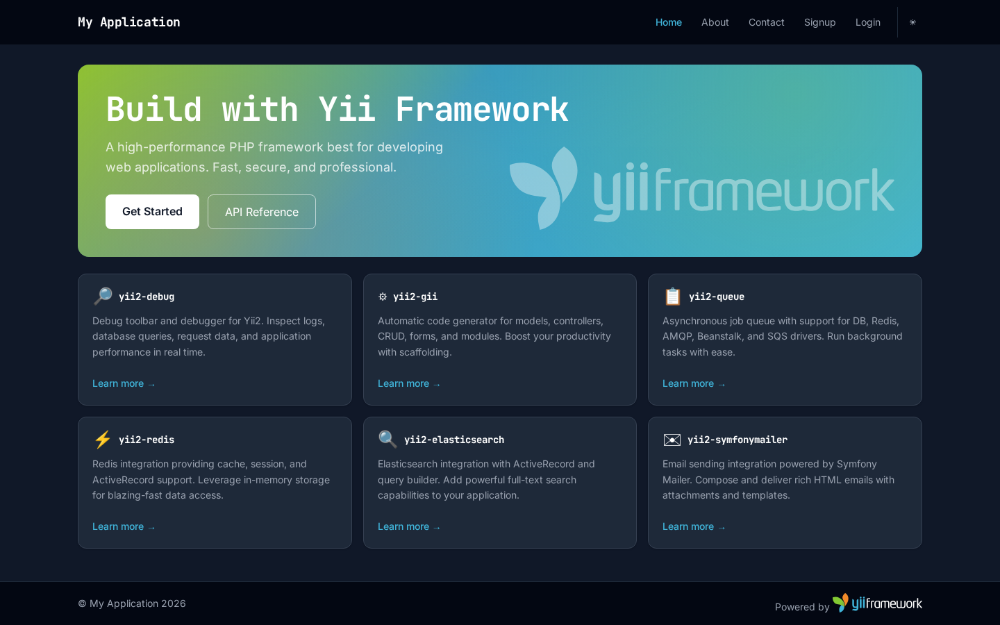
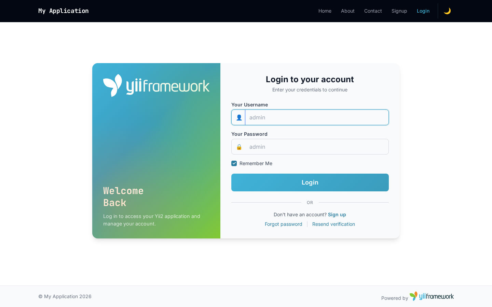
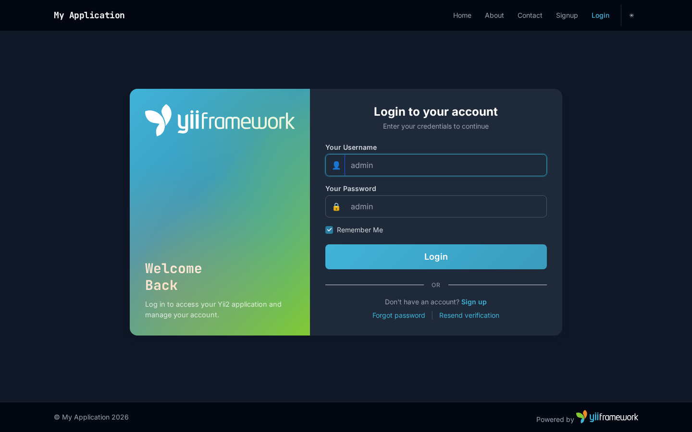
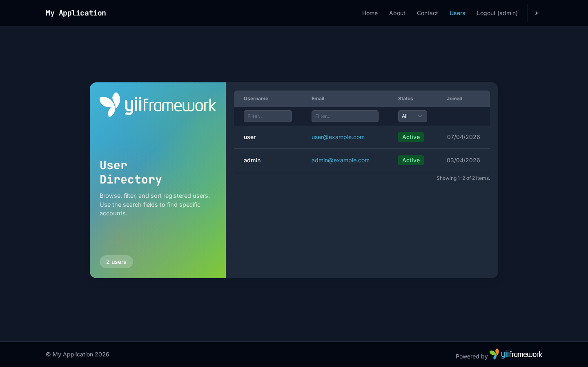
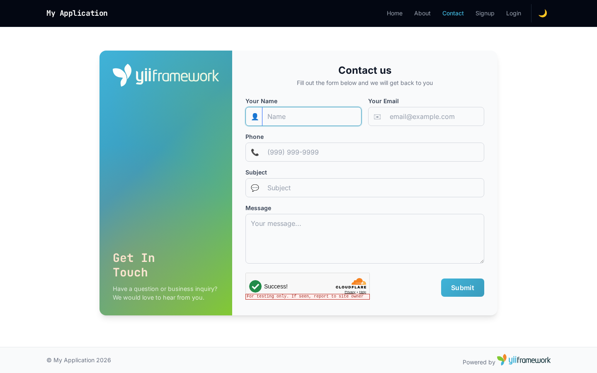
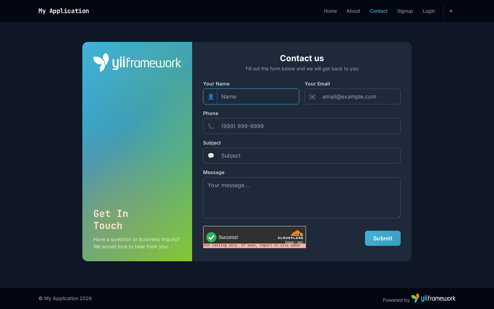

<!-- markdownlint-disable MD041 -->
<p align="center">
    <picture>
        <source media="(prefers-color-scheme: dark)" srcset="https://www.yiiframework.com/image/design/logo/yii3_full_for_dark.svg">
        <source media="(prefers-color-scheme: light)" srcset="https://www.yiiframework.com/image/design/logo/yii3_full_for_light.svg">
        
    </picture>
    <h1 align="center">Yii2 Inertia.js + Vue 3 Application</h1>
    <br>
</p>
<!-- markdownlint-enable MD041 -->

<p align="center">
    <a href="https://github.com/yii2-framework/app-inertia-vue/actions/workflows/build.yml" target="_blank">
        
    </a>
    <a href="https://github.com/yii2-framework/app-inertia-vue/actions/workflows/static.yml" target="_blank">
        
    </a>
    <a href="https://github.com/yii2-framework/app-inertia-vue/actions/workflows/ecs.yml" target="_blank">
        
    </a>
</p>

<p align="center">
    <strong>A modern Yii2 application template with Inertia.js, Vue 3, Tailwind CSS, and Flowbite</strong><br>
    <em>Server-driven SPA with authentication, dark mode, Codeception tests, and PHPStan</em>
</p>

## Screenshots

| Light                                           | Dark                                          |
| ----------------------------------------------- | --------------------------------------------- |
|        |        |
|      |      |
|      |      |
|  |  |

## Stack

| Layer            | Technology                                 |
| ---------------- | ------------------------------------------ |
| Backend          | PHP 8.2+, Yii2, Inertia.js server adapter  |
| Frontend         | Vue 3, Inertia.js client, Vite             |
| CSS              | Tailwind CSS v4, Flowbite, Flowbite Vue    |
| CAPTCHA          | Cloudflare Turnstile                       |
| Testing          | Codeception (unit, functional, acceptance) |
| Static Analysis  | PHPStan (max level)                        |
| Asset Management | php-forge/foxy (npm via Composer)          |

## Features

- Inertia.js SPA navigation (no full page reloads)
- Vue 3 Composition API with `<script setup>`
- Tailwind CSS v4 with Flowbite components
- Dark mode toggle (localStorage + system preference)
- User authentication (login, signup, email verification, password reset)
- Admin user listing with server-side sorting, filtering, and pagination
- Contact form with Cloudflare Turnstile CAPTCHA
- Responsive split-card design with brand gradient
- JetBrains Mono + Inter typography
- Codeception tests (unit, functional, acceptance)
- PHPStan max level static analysis
- ECS coding standard

## Quick start

```bash
git clone https://github.com/yii2-framework/app-inertia-vue.git
cd app-inertia-vue
composer install
php yii migrate
```

Start the development servers:

```bash
npm run dev          # Vite dev server (terminal 1)
php yii serve        # PHP dev server (terminal 2)
```

Open `http://localhost:8080`. Default admin credentials: `admin` / `admin`.

**Important:** Change default credentials immediately. Do not use them in production.

## Documentation

- 📚 [Installation Guide](docs/installation.md)
- ⚙️ [Configuration Reference](docs/configuration.md)
- 💡 [Usage Examples](docs/examples.md)
- 🧪 [Testing Guide](docs/testing.md)


## Testing

```bash
composer test
```

Runs all Codeception suites (unit, functional, acceptance) with code coverage.

## Static analysis

```bash
composer static
```

## Package information

[](https://www.php.net/releases/8.2/en.php)
[](https://packagist.org/packages/yii2-framework/app-inertia-vue)

## Quality code

[](https://codecov.io/github/yii2-framework/app-inertia-vue)
[](https://github.com/yii2-framework/app-inertia-vue/actions/workflows/static.yml)
[](https://github.styleci.io/repos/698621511?branch=main)

## Our social networks

[](https://x.com/Terabytesoftw)

## License

[](LICENSE)
